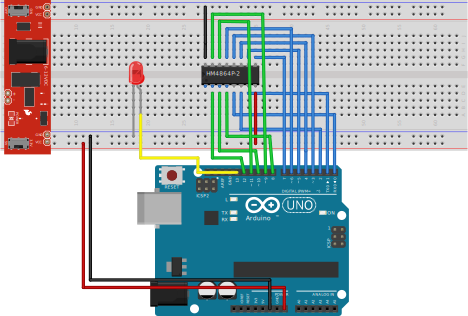

# Hitachi 4864P-2 Memory Tester

This is a Arduino sketch to test Hitachi [HM4864P-2](https://www.datasheets360.com/part/detail/hm4864p-2/2844863174925753224/) dynamic memory chips, used in some Commodore C64 boards. It was written using plain AVR-libc omitting the Arduino bootloader, mainly due to poor switching speed of Arduino's ```digitalWrite()``` (overhead up to 40 times slower) and 10us upper limit for HM4864P-2 RAS strobe. 

## Prerequisites

All you need are:

* Arduino Uno or any pin compatible board.
* ISP programmer (I use stk500 compatible programmer).
* A single HM4864P-2 chip. 

## Operation

* LED is glowing continuously - memory chip has passed all tests.
* LED is binking - memory chip is damaged.

## Schematics



## Acknowledgments

* This is a simple educational project, and was developed to this sole purpose.
* I take no responsibility for any negative outcomes or damage you may encounter using this project.

